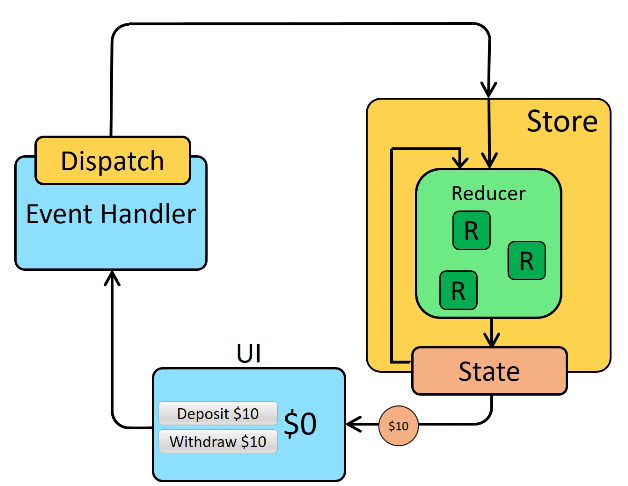
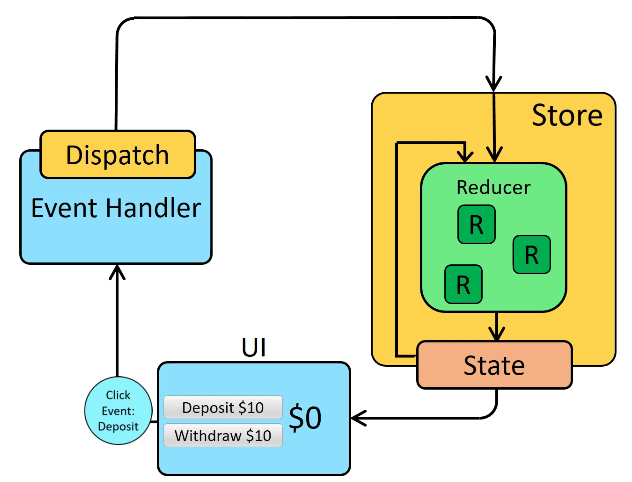
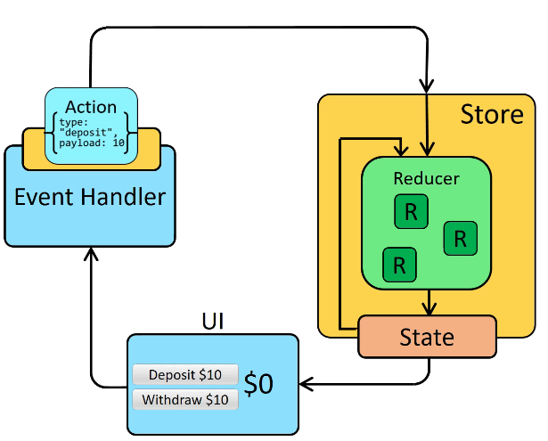
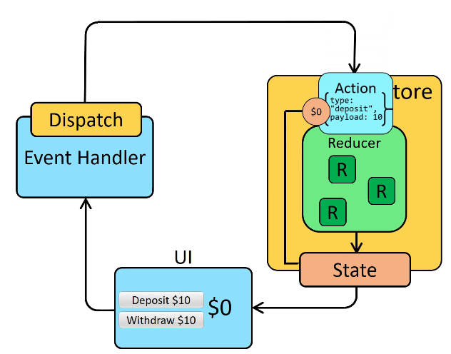

## Redux

- A state management system for cross-component or app-wide state 
- Context API drawbacks
    - Complex setup/management: In more complex apps, managing React Context can lead to deeply nested JSX code and/or huge “Context Provider” components.
    - Performance: React Context is not optimzed for high-frequency state changes

- Redux consists in a Central Data (state) store to which …
    - Components Subscribe to receive updates on state.
    - Reducer Functions mutate Store data.


|  |  |
|:---|:---:|
|  |  |


<br>


- **Store creation example**
    - Note that Redux can be used in any application (it doesn't have to be a React app); in this case a node.js app

```js
const redux = require('redux');

const counterReducer = (state = {counter:0}, action) => {
    return {
        counter: state.counter + 1
    }
}

const store = redux.createStore(counterReducer);

const counterSubscriber = () => {
    const latestState = store.getState();
    console.log(latestState);
}

store.subscribe(counterSubscriber);

store.dispatch({ type: 'INCREMENT' });
```
This will output: {counter:2}

That is because the reducer is initally dispatched with the default parameters passed to state/action when the store is created.

```js
const redux = require('redux');

const counterReducer = (state = {counter:0}, action) => {
    if (action.type === 'INCREMENT') return { counter: state.counter + 1 }
    if (action.type === 'DECREMENT') return { counter: state.counter - 1 }
}

const store = redux.createStore(counterReducer);

const counterSubscriber = () => {
    const latestState = store.getState();
    console.log(latestState);
}

store.subscribe(counterSubscriber);

store.dispatch({ type: 'INCREMENT' });
store.dispatch({ type: 'DECREMENT' })
```
This will output: {counter: 0}


<br>


- **Using Redux with React example**

1. Create the store
```js
import { createStore } from "redux";

const counterReducer = (state = {counter:0}, action) => {
    if (action.type === 'INCREMENT') return {counter: state.counter + 1}
    if (action.type === 'DECREMENT') return {counter: state.counter - 1}
    if (action.type === 'INCREASE_N') return {counter: state.counter + action.amount}

    return state;
}

const store = createStore(counterReducer);

export default store;
```
2. INSERT the Provider referencing the store in the component (or parent) where we want to use the store
```js
import store from './store/index';
root.render(<Provider store={store}><App /></Provider>);
```
3. Subscribe to state changes with useSelector and update the state using useDispatch
```js
import classes from './Counter.module.css';
import { useSelector, useDispatch } from 'react-redux';

const Counter = () => {

  const counter = useSelector((state) => state.counter);
  const dispatch = useDispatch();

  const incrementHandler = () => dispatch({type: 'INCREMENT'});

  const decrementHandler = () => dispatch({type: 'DECREMENT'});

  const increment5handler = () => dispatch({type: 'INCREASE_N', amount:5});

  return (
    <main className={classes.counter}>
      <h1>Redux Counter</h1>
      <div className={classes.value}>{counter}</div>
      <div>
        <button onClick={incrementHandler}>Increment</button>
        <button onClick={decrementHandler}>Decrement</button>
        <button onClick={increment5handler}>Increase by 5</button>
      </div>
    </main>
  );
};

export default Counter;
```


<br>


- ADVANCED REDUX
    - Reducers must be pure, side-effect free, synchronous functions
    - Where should side effects be executed (for example an http request) ?
        - Inside components (e.g. useEffect)
        - Inside action creators
            - Thunks
                - A function that delays an action until later
                - An action creator function that dows not return the action itself but another function which eventually returns the action
            - Ex:

1. create a function that returns another function which is the responsible of dispatching actions and sending an http request. 
    - Redux executes the returned function for us 
    - The dispatch object is automatically provided by Redux when calling this function using dispatch.

```js
export const sendCartData = (cart) => {

  return async (dispatch) => {
    dispatch(
      uiActions.showNotifications({
        status: 'pending',
        title: 'Sending...',
        message: 'Sending cart data'
      })
    )

    const sendRequest = async () => {
      const response = fetch('...', {
        method: 'POST',
        body: JSON.stringify(cart)
      })
      
      if (!response.ok) throw new Error();
    }

    try {
      await sendRequest();
      
      dispatch(
        uiActions.showNotifications({
          status: 'success',
          title: 'Success!',
          message: 'Sent cart data successfully'
        })
      )
    } catch (error) {
      dispatch(
        uiActions.showNotifications({
          status: 'error',
          title: 'Error!',
          message: 'Sending cart data failed'
        })
      )
    }
  }
}
```
2. use the function in a component by dispatching it. We can for example use useEffect.
```js
useEffect(() => {
    dispatch(sendCartData(cart));
}, [cart, dispatch]);
```


<br>


- **Redux DevTools**
    - Debug Redux applications easier
    - És un repo de github i hi ha una extensió per chrome
        - Una vegada instal·lada la extensió, podem veure DevTools en una de les pestanyes de Inspeccionar
    - Només funciona amb redux toolkit
    - Ens permet 
        - veure totes les accions (dispatch) que es fan a la nostra aplicació
        - veure les dades que es modifiquen de la nostra "store" 
        - saltar a states passats de la nostra "store"
